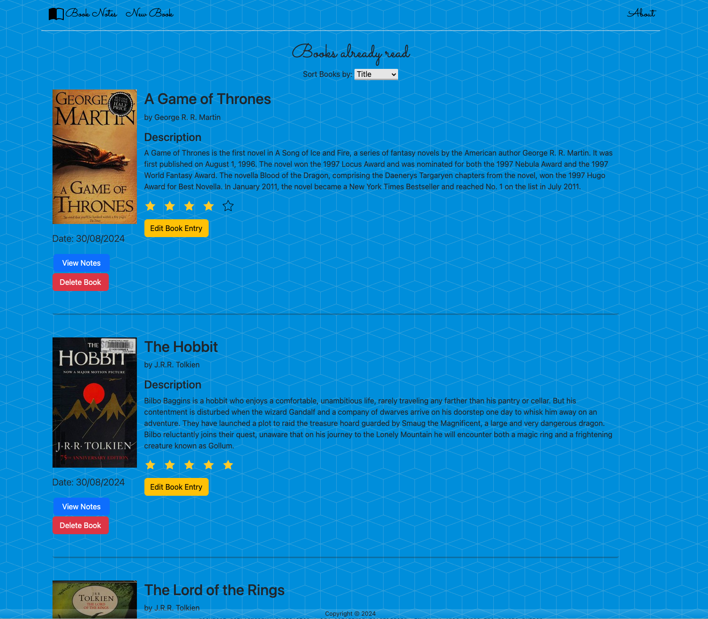
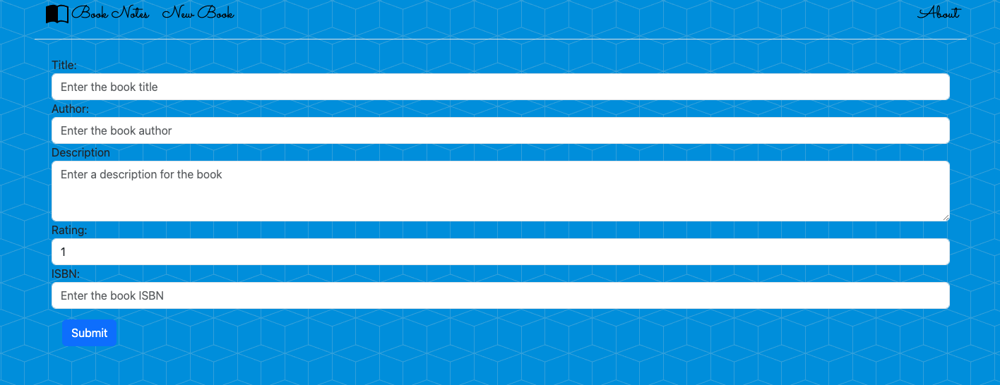
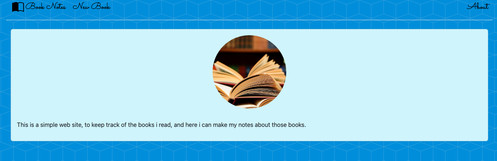

# capstone-project-book-notes

# Book Notes

- Book Notes is a project that we have done for the Udemy course "The Complete Web Development Bootcamp 2023 (by The App Brewery)";

# Instructions

### Overview

> I read a lot of books but after I finish reading them I often don't remember all the most salient parts of the book. So I started taking notes. This capstone project is built on this idea. My friend Derek Sivers has this fantastic website where he has all the non-fiction books he has read, his notes, his ratings and when he read them. The books are sortable by rating, recency and title. It's a such cool idea for a project so I'm including it as a capstone here in this course.

### Objectives

    - Revise how to integrate public APIs into web projects.

    - Gain more experience using Express/Node.js for server-side programming.

    - Demonstrate ability to Create Read Update and Delete data in a PostgreSQL Database to persist data.

### Example Ideas

    - Use the Open Library Covers API to fetch book covers.

    - Create a database to store books you have read.

    - Have a way to add new data about books, update previous reviews and delete entries.

    - Display this information from your database in a website like https://sive.rs/book

    - Be able to sort your book entries by rating and recency.

### Features

    - CRUD methods;
    - PostgreSQL;
    - Express
    - EJS;
    - Open Library API;

### Project Description

    - This project show the books that the user has read. It can sort the books based on title, date read, and rating.
    - The project have the ability to create notes about the books as well.

### Project Features

    - **Get Books**: Will show the information about the list of books the user has read;
    - **Add new book**: Will add a new book with the title, author, description, rating, isbn, imagepath, date_when_read;
    - **Update book**: Will update the informations about the specific book(using the id);
    - **Delete book**: Will delete a specific book(using the id), as well the associated note(s);
    - **Sorting the list of books**: Will sort the books by title, date read, and rating;
    - **Notes**: Will show the notes about a specific book(using the id), it can view, add, update and delete;

### API Interaction

    - When add a book, will use the ISBN, to build the URL to the image cover, from the [Open Library Search API](https://openlibrary.org/dev/docs/api/covers), and will save the URL the in the databse;

### EJS Rendering

    - The frontend, is build using ejs files with HTLM and CSS for a dynamic interaction;

### PostgreSQL

    - The database is created in the PostgreSQL with pgAdmin, persistent data;
    - It have two tables, "books" and "notes";

### Installation

    - Clone the repository;
    - Install the required dependencies using "npm install";
    - Create the necessary tables in your PostgreSQL database. You can copy the SQL queries from the queries.sql file and execute them in your database management tool;
    - Configure the database connection settings in the db config object in the index.js file;
    - Create a .env file to put your credentials, and update the db config to use your info:
    PG_USER="your-username"
    PG_HOST="your-host-address"
    PG_DATABASE="your-database-name"
    PG_PASSWORD="your-password"
    PG_PORT="your-daabase-port"

### How to Use

    - Run the app using the > nodemon index
    - Open a page in the browser on > localhost:3000

### Screenshots

    1 - Page of the list of books, with the information about them, as well the header, footer, and sort button:

  

    2 - Form to add a new book:

  

    3 - Form to edit a specific book:

  

    4 - Notes for a specific book:

  

    5 - About page:

  

